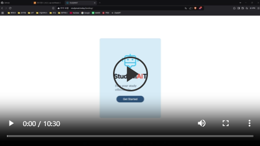
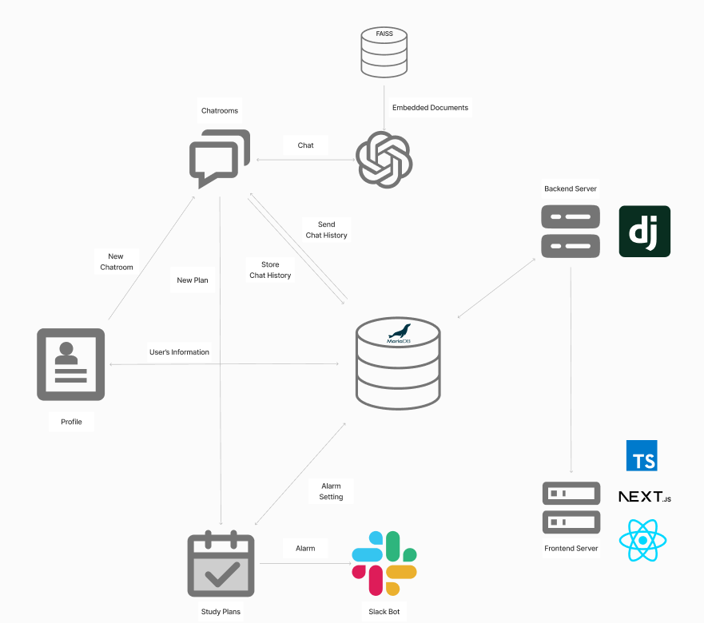
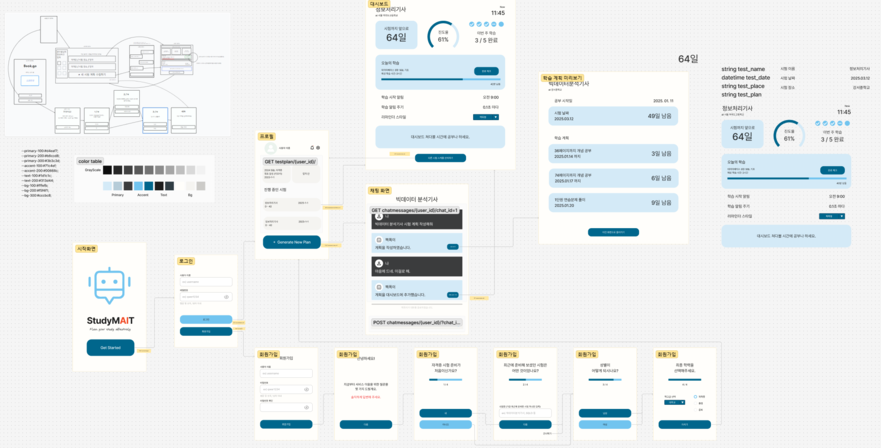
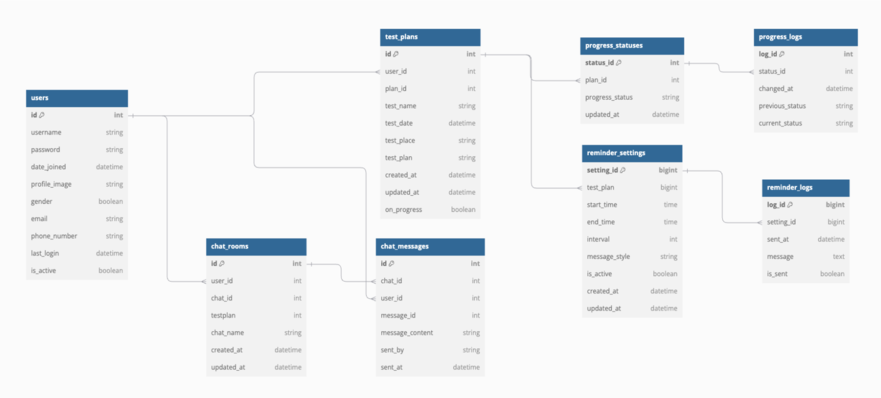
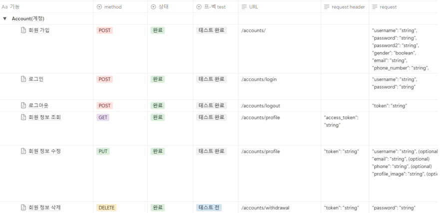
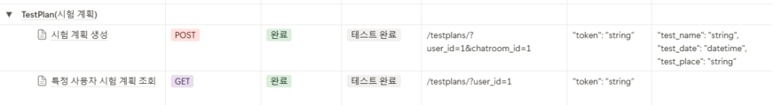
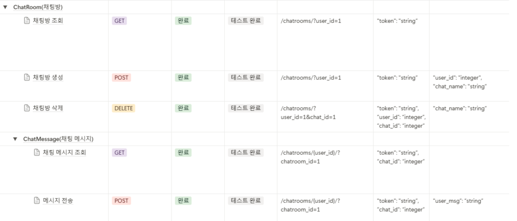
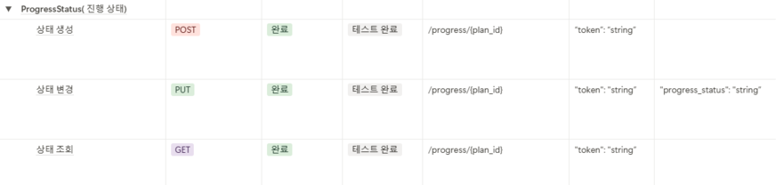
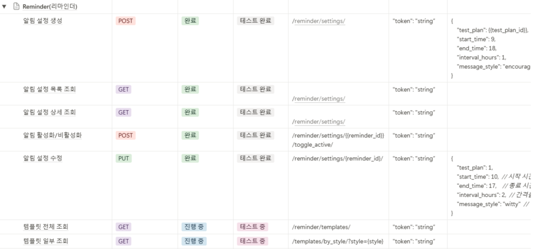

# 스터디메이트(StudyMAIT) 프로젝트


<summary style="font-weight:bold;">
  StudyMAIT는 수험생이 AI 챗봇과의 대화로 원하는 수험서를 선택하고, 선택한 수험서의 목차를 바탕으로 자동 학습 계획을 세워주는 서비스를 제공합니다.
</summary>
<summary style="font-weight:bold;">개발기간 : '24.12.30 ~ 25.1.30'</summary>
<br>

## ****📌 프로젝트 개요****
#### 프로젝트 주제
- AI 챗봇을 통한 개인화된 학습 계획 수립과 진도 관리, 동기 부여 기능을 제공하는 학습 관리 서비스

#### 기획 의도
- 많은 사람들이 시험 준비 과정에서 학습 계획을 세우는 데 어려움을 겪으며, 효율적인 학습을 방해받거나 동기 부여가 저하되는 문제가 있습니다.
- 본 서비스는 AI 챗봇을 활용하여 사용자의 시험 정보를 기반으로 최적화된 학습 계획을 추천하고, 맞춤형 학습 경험을 제공합니다.
- 챗봇과의 대화를 통해 사용자는 응시할 시험과 연관된 도서를 추천받고, 해당 도서의 목차를 바탕으로 체계적인 학습 계획을 수립할 수 있습니다.
- 학습 계획의 진행을 돕기 위해 맞춤형 리마인더 기능을 제공하여, 사용자가 설정한 일정에 따라 지속적인 동기 부여를 받을 수 있도록 지원합니다.
- 대시보드 기능을 통해 다수의 시험 계획을 관리할 수 있으며, 각 시험별 맞춤형 리마인더 설정이 가능합니다.

<br/>

## 🥘 ****서비스 시연 영상****

[](https://www.youtube.com/watch?v=Yc4KHUYIVYA) 

<br>

## ⚙ ****기능 명세서****

  - 사용자 환경(회원가입, 로그인, 로그아웃, 회원정보 수정 등)
  - 수험 정보 기반 학습 계획 생성 및 관리 기능
  - 챗봇 기능
  - 진도 체크 기능
  - 학습 계획 리마인더 기능
  - 프론트엔드 기본 기능 (다크 모드)

<br>

## 🔨 ****개발 포지션 구성****

| 이름   | 역할  | 담당 업무    |
| :------: | :-----: | -------- |
| 윤수용    | 팀장    | 프로젝트 총괄, 백엔드 총괄 및 AI 담당, 인프라 구축, AWS 배포 |
| 유민석    | 팀원    | 프론트엔드 총괄, 디자인 총괄, 대시보드 기능 |
| 이지훈    | 팀원    | 리마인더 기능, 유저테스트, 문서 관리 |

- 협업 도구
  - github
  - Slack
  - Notion
  - Figma

- 버전 관리
  - git

<br>

## ****⛓ Tech Stack****  

  <details>
    <summary >Frontend</summary>
    <div markdown="1"></div>
  
  - **Next.JS** / **React** : 스터디 플래너이지만 대시보드를 보며 학습 진도를 체크하거나 챗봇과 대화하는 등 사용자와의 상호작용을 중시하므로 동적 웹 구현에 적합하여 사용했습니다.
  - **Typescript** : Next.js에서 사용하는 언어이며, javascript에서 더 나아가 타입을 선언하고 사용하므로 코드 가독성이나 서비스의 안정성 측면에서 더욱 우수한 점을 지니고 있습니다.

  </details>

  <details>
    <summary >Backend</summary>
    <div markdown="2"></div>
  
  - **Django DRF** :
    - Django DRF는 **직관적인 API 설계**를 지원하고, 자동으로 API 문서를 생성하며, Django의 ORM과 긴밀하게 통합되어 빠른 개발이 가능합니다.
    - API 설계 변경이나 유지보수가 쉽고, DRF의 직관적인 직렬화(serialization) 기능을 통해 데이터 검증과 변환이 간편합니다.

  </details>

  <details>
    <summary >Chatbot</summary>
    <div markdown="3"></div>
  
  - **RAG** :
    - 초/중/고 참고서, 외국어, 수험서/자격증, 컴퓨터/모바일 분야에 해당하는 1만 권 이상의 도서들을 알라딘 API를 사용해 그 목차와 함께 임베딩 해 두어, Chatbot의 책 검색에 활용합니다.
  - **Hybrid Search** :
    - 검색 키워드와 검색 결과의 유사성에 대한 점수를 통해 보다 더 효과적인 검색을 진행합니다.

  </details>

  <details>
    <summary >Database</summary>
    <div markdown="4"></div>
  
  - **MariaDB** : 초기 개발은 sqlite로 진행하였고, 속도와 MySQL과의 호환성을 고려해 MariaDB로 변경하였습니다.

  </details>

  <details>
    <summary >Server</summary>
    <div markdown="5"></div>
  
  - **AWS EC2** : 클라우드 가상 서버로 사용하고 있습니다.
  - **Gunicorn**: Django 애플리케이션을 WSGI 서버로 실행하기 위해 Gunicorn을 사용하고 있습니다.
  - **Nginx**: 배포 환경에서 프록시 서버로 사용하고 있으며, 정적 파일 및 보안 설정을 처리하고 있습니다.
  - **Ubuntu :** Nginx와 Gunicorn를 Ubuntu에서 설정하고 관리합니다.

  </details>
 
<br>

## 📚 ****기술적 의사 결정****
### [의사 결정 세부 내용 문서](https://teamsparta.notion.site/0ad41eac039d4577b3207a3e3f7e3e39)

  <details>
    <summary >프론트엔드</summary>
    <div markdown="1"></div>
  
  - 깔끔한 디자인의 ui를 만들기 위해 [shadcn/ui](https://ui.shadcn.com/)를 적용
  - 각 지표를 요소별로 표시해야 하므로 인터페이스를 컴포넌트화하여 관리하기 용이한 Next.js를 채택

  </details>

  <details>
    <summary >백엔드</summary>
    <div markdown="2"></div>
  
  - 프론트엔드와 백엔드를 따로 구현해서 서버 하나에 올리기로 결정
  - 최적화를 위해 django는 별도의 템플릿 구현 없이 rest framework를 사용해서 API 기능만 구현하였다.

  </details>

  <details>
    <summary >챗봇</summary>
    <div markdown="3"></div>
  
  - 알라딘 API를 활용해 도서 정보를 임베딩하여 도서 검색 RAG를 구현
  - 사용자에게 더 알맞은 책을 검색하기 위하여 Hybrid Search 기술을 채택
  - 데이터를 효율적으로 저장하고 활용하기 위해 FAISS Vectorstore을 사용

  </details>

  <details>
    <summary >데이터베이스</summary>
    <div markdown="4"></div>
  
  - 대시보드 기능에서 그 날의 학습 완료 여부를 체크하기 위해 빠르고 안정적인 데이터 송수신이 요구됨
  - MySQL은 데이터 송수신에 빠른 처리 속도를 제공하므로 이를 사용

  </details>

  <details>
    <summary >리마인더</summary>
    <div markdown="5"></div>
  
  - 슬랙봇을 우선 도입하되, 다른 알림 방식을 향후 옵션으로 추가할 수 있도록 확장 가능한 구조로 개발하기로 결정
  - APScheduler를 사용하여 MVP를 구현하고, 이후 확장 단계에서 Celery와 Redis 전환 가능성을 열어두는 것으로 결정

  </details>

<br>

## 🤙 ****Trouble Shooting****

  <details>
    <summary >챗봇 트러블 슈팅</summary>
    <div markdown="1"></div>

  ### 챗봇 도서 검색 기능

  - **도입 이유**  
    - RAG를 활용해 사용자의 질문에 맞는 도서들을 추천하기 위해 도입.

  - **문제 상황**  
    1. 벡터스토어 생성 및 로드 할 때 올바른 경로를 전달받지 못함.  
    2. 벡터스토어를 찾지 못하는 경우에 대한 에러 처리가 되지 않음.

  - **해결 방안**  
    1. 파일이나 디렉토리에 대한 위치를 절대경로로 변환하여 전달.  
    2. 벡터스토어 로드에 실패하는 경우 벡터스토어 생성을 진행한 후 다시 로드 함수로 재호출하는 것으로 해결.

  - **의견 조율**  
    - 사용자가 처음 도서 검색 채팅을 입력했을 때 응답 속도가 느려지긴 하지만 서비스의 유지는 문제가 없음.

  - **의견 결정**  
    - 전체적인 시스템을 고려했을 때 반드시 필요한 기능이며, 속도보다는 안정성에 초점을 두어 조율한 의견대로 코드를 수정.

  ---

  ### 챗봇의 과거 대화 기억 문제

  - **도입 이유**  
    - 사용자와 챗봇의 이전 대화를 참고하여 답변을 생성하기 위해 도입.

  - **문제 상황**  
    - 챗봇 자체에 대화 내용을 기록할 경우 메모리를 사용할 때마다 메모리가 초기화되는 문제가 발생.

  - **해결 방안**  
    - 과거의 대화 기록을 DB에서 불러와서 사용자 질문과 함께 챗봇으로 전달.

  - **의견 조율**  
    - 과거 대화 내역 10개를 불러와 사용자 질문과 함께 묶어서 챗봇으로 전달.

  - **의견 결정**  
    - 과거의 기록을 참고로 학습 기능이 진행되기 때문에 조율한 의견대로 코드를 작성.


  </details>

  <details>
    <summary >프론트엔드 트러블 슈팅</summary>
    <div markdown="1"></div>

  ### 다크 모드 도입

  - **도입 이유**  
    - 대시보드를 켜놓고 사용할 것을 가정했을 때, 어두운 환경에서 공부하는 수험생들을 위해 해당 테마 지원이 필요할 것으로 판단함

  - **문제 상황**  
    - 앱 전역 layout에 ThemeProvider를 이용해서 레이아웃을 감싸고 테마를 변경할 수 있는 버튼을 컴포넌트로 각각 추가하였음.
    - 그러나 정작 대시보드 화면에서는 배치상 문제로 이 버튼이 등장하지 않음.

  - **해결 방안**  
    1. 테마 변경 버튼을 고정 위치에 출력하도록 tailwind css에 absolute 키워드를 사용
    2. 필요한 앱 부분에만 따로 디자인해서 컴포넌트를 삽입

  - **의견 조율**  
    - 사용자가 자주 보게 될 화면은 대시보드 화면, 채팅 화면, 프로필 화면으로 버튼이 필요한 화면 수가 상대적으로 적음.
    - 또한 1안을 채택하게 되면 고정된 위치에 버튼이 나오는 것은 일관성 측면에서는 좋으나다른 UI 요소와 잘 어우러지지 않고 미관을 해치는 경향이 있음.

  - **의견 결정**  
    - 위와 같은 근거로 2안을 채택하고 각 화면마다 아이콘 디자인은 통일한 채로 영역을 따로 설정해 주는 방법으로 해결함.

  ---

  ### 새로고침 시 인증이 무효되는 현상

  - **도입 이유**
    - 대시보드는 서버와의 통신을 하며 데이터를 갱신해야 하므로 일정 주기를 갖고 새로고침되어야 할 수 있음. 그러나 이때 로그인 상태가 풀리며 강제로 다시 로그인 화면으로 리디렉션됨. 이는 사용자 경험을 크게 해치는 결과로 이어지므로 이 문제를 해결하고자 하였음.

  - **문제 상황**  
    - 브라우저에서 새로고침 버튼을 누를 시 어떠한 앱이든 인증 토큰을 유지하지 못한 채로 로그인 화면으로 강제 리디렉션 됨.

  - **해결 방안**  
    - 기존에 access 토큰만을 이용해서 인증하는 상태이므로 새로고침 시 이 토큰은 무효화 됨. 따라서 refresh 토큰을 이용해서 access 토큰 무효 시 이를 재발급 받고 다시 저장한 후 인증을 시도하는 로직을 추가함.
    - 이 과정에서 새로고침 시 로그인 상태에 대하여 변수로 관리하는 것은 어려움이 있으므로 이벤트 발생 시 인증을 진행하는 checkAuth 함수를 추가함.
    - 이후부터는 인증이 필요한 앱마다 useEffect 내에서 checkAuth 함수를 호출하여별도의 상태 관리 없이 페이지 로드 시마다 인증 상태를 확인해 주기만 하면 됨.

  </details>

  <details>
    <summary >리마인더 트러블 슈팅</summary>
    <div markdown="1"></div>

  ### 슬랙봇 알림 기능 도입

  - **도입 이유**  
    - MVP 리마인더 기능 구현에서 웹 푸시 알림과 이메일 알림 방식이 실패하여 대처 방안을 모색. 
    - 슬랙은 서비스 커뮤니케이션의 주요 도구로 이미 쓰이고 있기에, 슬랙봇을 활용한 알림이 사용자 접근성과 구현 용이성 측면에서 적합한 대안으로 판단

  - **문제 상황**  
    <웹 푸시 알림 실패 원인>
    1. 브라우저 간 푸시 알림 호환성 문제
    2. HTTPS 인증서와 Web Push Protocol 설정 과정에서 VAPID KEY 관련하여 이해 못하는 에러 발생

    <이메일 알림 실패 원인>
    1. Celery와 Redis를 스케줄러로 쓰면서 오버엔지니어링으로 판단, 개발 중지
    2. 트러블 슈팅 2번 항목으로 이어짐(APScheduler 도입)

  - **해결 방안**  
    - 슬랙 API를 활용하여 슬랙봇 알림 기능을 구현

    <슬랙봇 구현 방식>
    1. 슬랙 API를 통해 OAuth 인증과 앱 통합 작업 완료
    2. Django와 슬랙 Web API를 연동하여 알림 메시지 전송 로직 구현

    <알림 기능 주요 특징>
    1. 맞춤형 메시지 스타일 
    사용자의 상황과 성향에 맞게 다양한 메시지 스타일과 템플릿을 마련하여 반복적인 알림도 지루하지 않게 받을 수 있음
    2. 유연한 알림 설정
    시험 계획 별로 독립적으로 알림설정(시작 시간, 종료 시간, 알림 간격)을 직접 할 수 있어 개개인의 학습 패턴에 맞춤화

  - **의견 조율**  
    - 웹 푸시 알림은 현재 도입한 기술 스택상 구현이 어려워 이메일 알림을 구현하려고 했지만, 팀 내에서는 슬랙봇 활용에 대해 더 긍정적인 의견을 주었습니다.

    <긍정적 측면>
    1. 슬랙은 팀 협업 도구로 널리 사용중이며 추가 설정이 필요 없음
    2. 슬랙 API는 안정적이고, 구현 및 유지보수 비용이 상대적으로 낮음

    <부정적 측면>
    1. 슬랙 비활용 사용자가 알림을 받지 못하는 한계
    2. 기존 웹 푸시와 이메일 알림보다 익숙하지는 않음

  - **의견 결정**  
    - 슬랙봇을 우선 도입하되, 다른 알림 방식을 향후 옵션으로 추가할 수 있도록 확장 가능한 구조로 개발하기로 결정

    <최종 결정 이유>
    1. 슬랙 사용자 비율이 높아 초기 대응이 용이함
    2. 구현 난이도가 낮고, 개발 속도를 단축할 수 있음
    3. 실패했던 웹 푸시와 이메일 알림의 대안으로 적합하다는 점에 팀 전원 동의
  ---

  ### 스케줄러: Celery와 Redis에서 APScheduler로 변경

  - **도입 이유**  
    - 초기에는 Celery와 Redis를 활용해 리마인더 알림 스케줄링을 구현하려 했으나, 다음과 같은 이유로 APScheduler로 변경

    1. MVP 단계에서 단순성 필요: Celery와 Redis는 MVP 단계에서는 복잡한 설정과 관리가 오히려 비효율적이라고 판단
    2. 개발 시간 절약 필요

  - **문제 상황**  
    <Celery와 Redis 도입 시 문제점>
    1. 설치 및 설정 복잡
    Celery와 Redis를 연동하기 위해 추가적인 설정 작업이 필요했고, 특히 Windows환경에서는 비동기 작업을 관리하는데 예상보다 많은 시간과 노력이 들었음
    2. Redis가 정상 작동하지 않으면 Celery 작업도 실패하는 점이 부담


  - **해결 방안**  
    <APScheduler의 장점>
    1. 간단한 설정
    Python 라이브러리로 설치와 설정이 간편함
    2. 서버 리소스 절감
    Redis와 같은 메시지 브로커가 필요하지 않아 서버 리소스를 절감할 수 있음

    <구현 방식>
    1. Django와 APScheduler를 연동하여 작업 스케줄을 관리
    2. 알림 실패 시 재시도 로직 추가

  - **의견 조율**  
    - Celery/Redis에 비해 간단하고 빠르게 구현할 수 있어 개발 시간과 운영 부담을 줄일 수 있음을 팀원에게 설명

  - **의견 결정**  
    - APScheduler를 사용하여 MVP를 구현하고, 이후 확장 단계에서 Celery와 Redis 전환 가능성을 열어두는 것으로 결정

  </details>

  <details>
    <summary >백엔드 트러블 슈팅</summary>
    <div markdown="1"></div>

  ### 모델 간 순환 참조

  - **도입 이유**  
    - ERD 문서 상 ChatRoom과 TestPlan이 서로 1:1 관계이어야 했음

  - **문제 상황**  
    1. ChatRoom과 TestPlan이 서로를 참조하면서 초기화 순서 문제가 발생
    2. DB에 기존 데이터가 없으면 잠금을 설정할 대상이 없어서, 새로운 chat_id에 대한 첫 번째 TestPlan을 생성 시 select_for_update()가 작동하지 않음

  - **해결 방안**  
    1. 모델 참조를 문자열로 변경하여 순환 참조 문제를 해결
    2. pre_save()를 사용해 TestPlan을 저장하기 전에 DB에 데이터가 없는 경우, plan_id를 1로 설정하고 transaction.atomic()으로 동시성 문제를 방지

  - **의견 조율**  
    - ChatRoom과 TestPlan이 1:1 관계이더라도 어떤 것이 주가 되어야 하는지 의견 조율

  - **의견 결정**  
    - 전체적인 시스템 흐름을 고려할 때 ChatRoom이 주가 되어 TestPlan을 참조하는 방식으로 진행

  ---

  ### 사용자 인증 문제

  - **도입 이유**  
    - 로그인한 유저의 정보가 아닌 타 사용자의 정보를 보면 안되기 때문

  - **문제 상황**  
    - 유저가 로그인에 성공하면 다른 유저들의 정보를 조회, 수정이 가능

  - **해결 방안**  
    - IsOwner Permission class를 작성하여 사용자 인증 문제 해결

  - **의견 조율**  
    - 사용자 인증을 어떤 방식으로 받을 지에 대한 의견 조율

  - **의견 결정**  
    - 위의 해결 방안대로 IsOwner class를 만들어 Permission 검증하는 방식으로 진행

  </details>

<br/>

## 🔍 ****Directory Structure****
```
.
|-- README.md                   # 프로젝트 설명 및 실행 가이드 
|-- backend                     # 서버 측 코드
|   |-- AIBookAgent             # 도서 수집 및 임베딩 관련 모듈
|   |-- StudyMAIT               # 프로젝트 Setting 관련 모듈
|   |-- accounts                # 사용자 계정 관련 모듈
|   |-- archievements           # 사용자 업적 관련 모듈
|   |-- chatrooms               # 사용자 채팅 관련 모듈 
|   |-- Dockerfile              # 백엔드 Docker 설정 파일 
|   |-- manage.py               # Django 관리 스크립트
|   |-- nginx.Dockerfile        # nginx Docker 설정 파일
|   |-- nginx.conf              # 웹서버 기본 설정 파
|   |-- reminder                # 시험 계획 알림 관련 모듈
|   |-- requirements.txt        # Python 패키지 의존성 목록
|   `-- testplans               # 시험 계획 관련 모듈 
|-- docker-compose.yml          # Docker Compose 구성 파일 
|-- frontend                    # 클라이언트 측 코드
|   |-- Dockerfile              # 프론트엔드 Docker 설정 파일 
|   |-- README.md               # 프론트엔드 설명 및 가이드 
|   |-- components.json         # shadcn/ui configuration 파일
|   |-- eslint.config.mjs       # 타입스크립트 문법 오류 시 표시해주는 도구
|   |-- next-env.d.ts           # 타입스크립트 컴파일러가 Next.js의 타입을 가져오게 함
|   |-- next.config.ts          # next.js configuration 파일
|   |-- node_modules            # 설치된 패키지들이 있는 디렉토리
|   |-- package-lock.json       # 의존성 트리에 대한 정보를 가진 파일
|   |-- package.json            # 의존성 목록이 있는 파일
|   |-- postcss.config.mjs      # postcss configuration 파일
|   |-- public                  # 폰트, 이미지 등 리소스 폴더
|   |-- src                     # 
|   |   |-- app                 # 라우팅으로 아래 페이지들을 정의
|   |   |   |-- chat            # 채팅 페이지
|   |   |   |-- dashboard       # 대시보드 페이지
|   |   |   |-- landing         # 서비스 랜딩 페이지
|   |   |   |-- login           # 로그인 페이지
|   |   |   |-- plan-preview    # 시험 계획 미리보기 페이지
|   |   |   |-- profile         # 프로필 페이지
|   |   |   |-- register        # 회원가입 페이지
|   |   |   |-- favicon.ico     # 크롬 탭 등에 뜨는 앱 아이콘
|   |   |   |-- globals.css     # 전체 페에지 스타일 정의
|   |   |   |-- layout.tsx      # 전체 페이지 레이아웃 정의 (ThemeProvider, AuthProvider 적용)
|   |   |   `-- page.tsx        # 
|   |   |-- components          # 각 페이지마다 공통으로 사용되는 UI 컴포넌트 관리
|   |   |-- contexts            # 로그인 이후 토큰 관리
|   |   |-- hooks               # Django 백엔드 연결 및 API 호출
|   |   `-- utils               # 날짜 데이터 관련 처리 함수 선언
|   |-- tailwind.config.ts      # tailwindcss configuration 파일
|   |-- tsconfig.json           # typescript configuration 파일
|   `-- yarn.lock               # yarn 패키지 버전 고정 파일 
|-- img                         # 이미지 파일 모음 
`-- mariadb                     # 데이터 베이스 관련 파일 

```

<br/>

## 🧱 ****Project Architecture****



<br>

## 🕸 ****[Wireframe]****


<br>

## 🛢 ****[Database ERD]****




<br>

## 🎯 ****API 명세서**** 


<details>
<summary style="font-size: 18px;">Account API</summary>
<div markdown="1">



</div>
</details>


<details>
<summary style="font-size: 18px;">TestPlan API</summary>
<div markdown="1">



</div>
</details>

<details>
<summary style="font-size: 18px;">Chatroom API</summary> 
<div markdown="1">



</div>
</details>


<details>
<summary style="font-size: 18px;">ProgressStatus API</summary>
<div markdown="1">



</div>
</details>

<details>
<summary style="font-size: 18px;">Reminder API</summary>
<div markdown="1">



</div>
</details>

<br>

## 🔗 ****Link**** 
### [Notion 현황판](https://teamsparta.notion.site/Cbook-go-16c2dc3ef51481d8a985c6c3eb448e18)
### [배포 사이트](http://studymait.today/)
